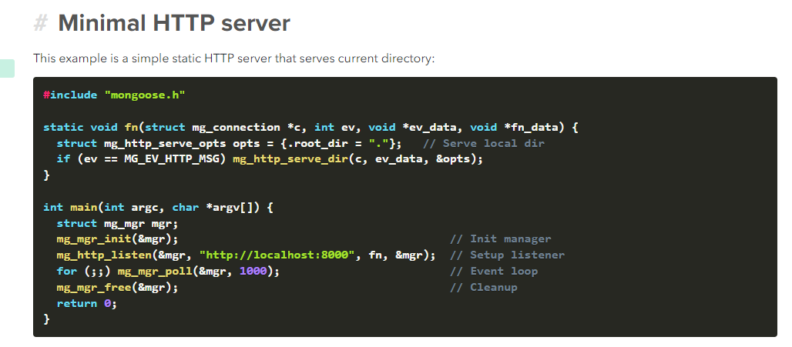
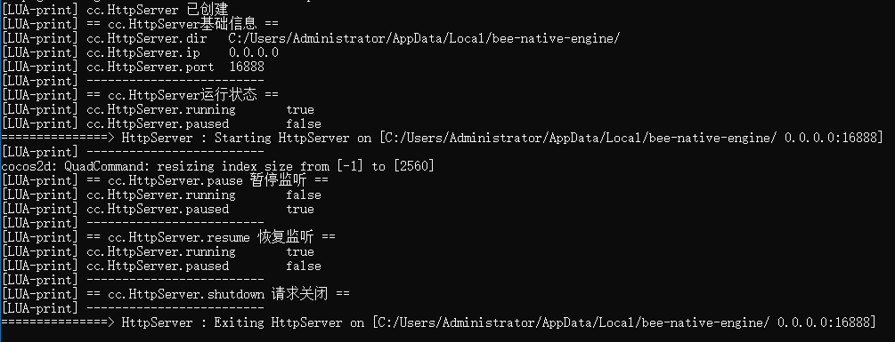
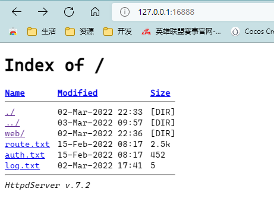

# cocos2d-x-lhs

## 一、介绍

**cocos2d-x-lhs** 是在 `Cocos2d-x` 内嵌 **HTTP 本地服务器** 的方案，借助 HTTP 服务器的便利，将 2d-x 的可读写目录通过 HTTP 服务器暴露出来，就可以做一些有趣的事情，比如说：

-   只要将日志保存在可读写目录，就可以很方便地查看日志，这样就可以忽略平台
-   在可读写目录放一个静态页面，可以通过 HTTP 服务器来呈现，配合 webview 非常适合：

    -   在游戏中做动态活动页面呈现
    -   甚至可以内嵌一个小游戏 _（这很有趣，后面有时间再拓展）_

## 二、实现

**cocos2d-x-lhs** 将 [mongoose](https://mongoose.ws/) 作为内嵌 HTTP 服务器，根据官网介绍：

>     Mongoose is a networking library for C/C++. It implements event-driven, non-blocking APIs for TCP, UDP, HTTP, WebSocket, MQTT. It connects devices and brings them online. Since 2004, a number of open source and commercial products have utilized it. It even runs on the International Space Station! Mongoose makes embedded network programming fast, robust, and easy.

可见它的使用场景相当丰富，而 HTTP server 只是它的冰山一角。

而且，移植也相当简单，只要引入 `mongoose.h/mongoose.c` 即可，附[下载地址](https://github.com/cesanta/mongoose/releases)。

接着根据文档，找到创建 HTTP server 示例：



可以知道，创建一个 HTTP server 需要三个要素：

-   监听目录
-   监听主机 IP
-   监听端口

我们进行封装的时候可以把它们提取出来作为参数传入，比如：`new HttpServer(dir, ip, port)`。

另外，需要注意的是：由于 `mongoose` 内部实现了事件循环，也就是 `Event loop` 部分，因此需要将这部分代码放在线程中执行，否则会阻塞 `2d-x` 主程序。

考虑到易用性，我们还需要扩展几个基础接口：

-   开启 `start`
-   关闭 `shutdown`
-   暂停 `pause`
-   恢复 `resume`
-   状态
    -   运行中 `running`
    -   已暂停 `paused`

## 三、使用

> 上述的接入过程这边已经搞定了，并且还贴心地给各位准备了 `Lua Binding` 接口，大家可以放心食用。

1. 将 `Classes` 下文件导入 `Cocos2d-x` 工程
2. 在 `AppDelegate.cpp` 中引入 `bee/http-server/lua-http-server.h`
3. 在 `applicationDidFinishLaunching` 中作为 `lua module` 引入 `lua_module_register_http_server(L)` 即可。

以下是在 Lua 层运行的测试的用例：

```lua
function startHttpServer(node)
    -- HttpServer指定的监听目录
    local server_dir = cc.FileUtils:getInstance():getWritablePath()

    -- HttpServer指定的IP，不填默认本机
    local server_ip = ''

    -- HttpServer指定的端口，默认16888
    local server_port = '16888'

    -- 创建一个HttpServer实例
    local server = cc.HttpServer:create(server_dir, server_ip, server_port)
    if tolua.isnull(server) then
        print('cc.HttpServer 创建失败')
        return
    end
    print('cc.HttpServer 已创建')

    -- 输出HttpServer基础信息
    print('== cc.HttpServer基础信息 ==')
    print('cc.HttpServer.dir ', server:dir())
    print('cc.HttpServer.ip  ', server:ip())
    print('cc.HttpServer.port', server:port())
    print('-------------------------')

    -- 启动HttpServer，此时网页可以访问了
    server:start()

    -- 查看HttpServer运行状态
    print('== cc.HttpServer运行状态 ==')
    print('cc.HttpServer.running', server:running())
    print('cc.HttpServer.paused', server:paused())
    print('-------------------------')

    -- 用延时来观察HttpServer暂停/恢复/关闭情况
    local time_handler_1 = function()
        server:pause()
        print('== cc.HttpServer.pause 暂停监听 ==')
        print('cc.HttpServer.running', server:running())
        print('cc.HttpServer.paused ', server:paused())
        print('-------------------------')
    end
    local time_handler_2 = function()
        server:resume()
        print('== cc.HttpServer.resume 恢复监听 ==')
        print('cc.HttpServer.running', server:running())
        print('cc.HttpServer.paused', server:paused())
        print('-------------------------')
    end
    local time_handler_3 = function()
        server:shutdown()
        print('== cc.HttpServer.shutdown 请求关闭 ==')
        print('-------------------------')
    end
    local time_handler_4 = function()
        if tolua.isnull(server) then
            print('cc.HttpServer 已关闭')
            print('-------------------------')
            return
        end
    end
    performWithDelay(node, time_handler_1, 10) -- 10秒后暂停，网页将不可访问
    performWithDelay(node, time_handler_2, 20) -- 20秒后恢复，网页访问恢复
    performWithDelay(node, time_handler_3, 30) -- 30秒后关闭，网页不可访问
    performWithDelay(node, time_handler_4, 40) -- 40秒后检测，此时server无效了
end
```

-   运行结果



-   HTTP server 视图


